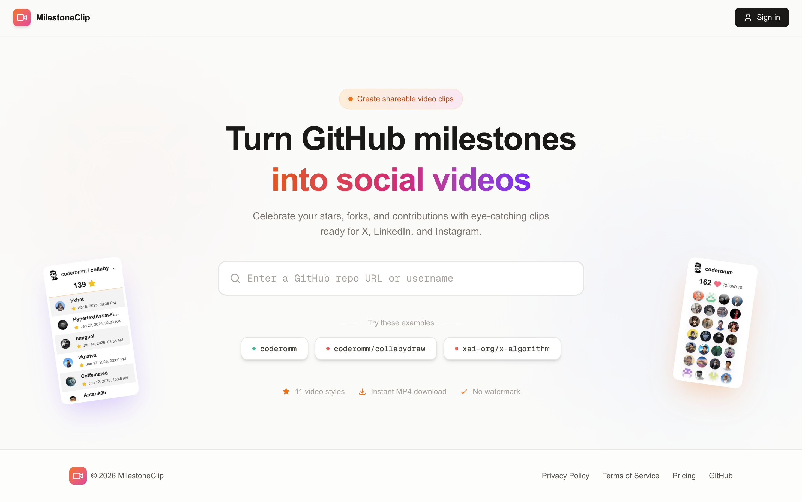
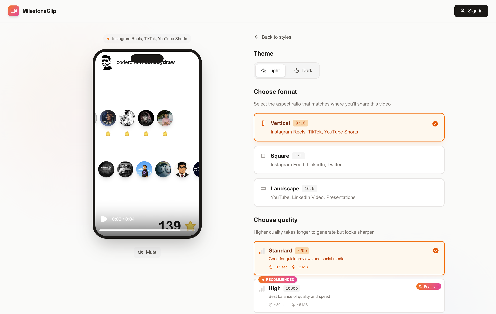
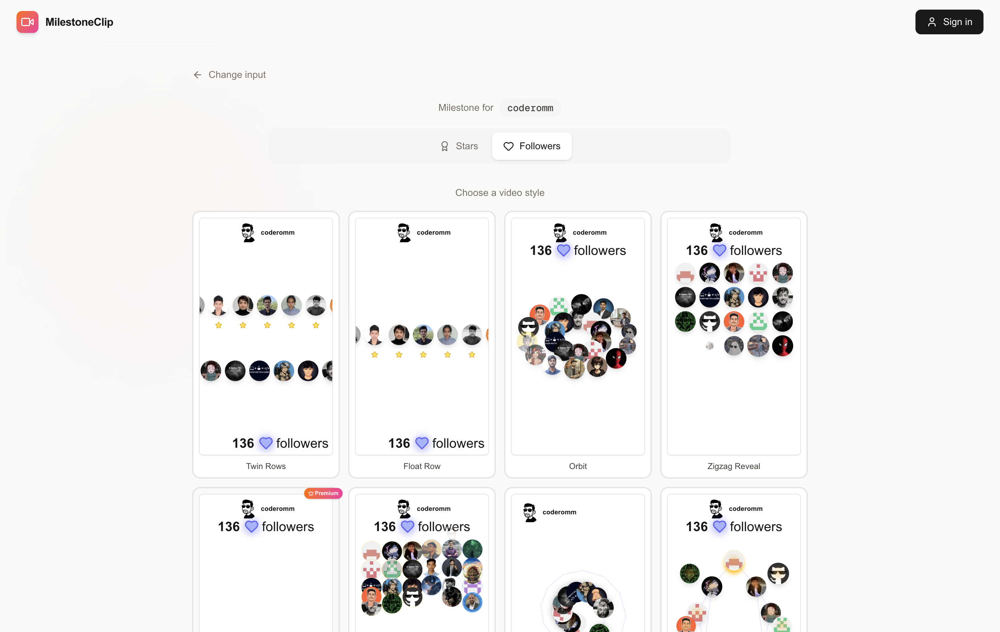
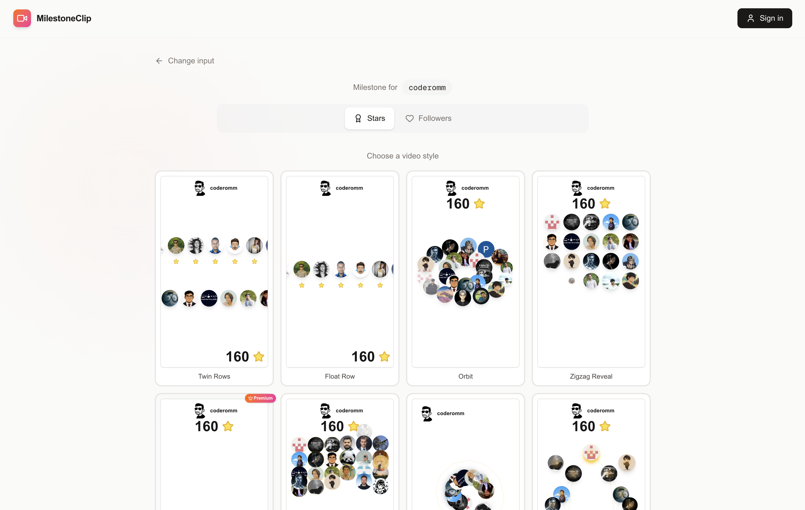

  
  <h1 align="center">Milestone Clip</h1>

**Turn GitHub milestones into shareable video clips.**

Celebrate your ⭐ stars, 🍴 forks, 👤 followers, and total stars with eye-catching videos ready for X, LinkedIn, and Instagram—no design skills required.

|  |  |
|--------------------------------------------------------------------------|-----------------------------------------------------------------------------------|
| **🏠 Home** — Enter a repo or username                                   | **👁️ Preview** — Pick a style, format, and download                                  |

|  |  |
|------------------------------------------------------------------------------------------------|---------------------------------------------------------------------------------------|
| **📦 Repo milestone** — e.g. collabydraw                                                       | **👤 User milestone** — e.g. coderomm                                                 |

---

## What is Milestone Clip? ✨

Milestone Clip is a web app that turns your GitHub milestones into short, polished video clips. Enter a repository or GitHub username, pick a milestone type and a visual style, and get an MP4 you can post anywhere. Built for developers, maintainers, and open-source communities who want to share their wins without spending hours in an editor.

---

## Who is it for? 👋

- **Open-source maintainers** — celebrating repo stars or forks
- **Developers** — showcasing follower growth or total stars across their work
- **Communities and teams** — sharing project milestones on social media
- **Anyone** — who wants a simple, professional way to turn GitHub numbers into shareable content

---

## Features 🚀

- **Repository milestones** — Stars and forks for any public repo
- **User milestones** — Followers and total stars across a user’s repositories
- **10+ video styles** — From minimal (Float Row, Zigzag Reveal) to cinematic (Spotlight, Feed, Spiral, Constellation, Mosaic, and more)
- **Multiple aspect ratios** — 9:16 (Reels/Shorts/TikTok), 1:1 (feed), 16:9 (YouTube, presentations)
- **Light & dark themes** — Match your brand or platform
- **Export options** — Standard quality on free tier; high and 4K on premium
- **Instant MP4 download** — No watermark, ready to post
- **Free tier** — 1 video per day with core styles and standard quality
- **Premium plans** — Unlock all styles, high/4K quality, and more generations (yearly or lifetime)

---

## Why I built this 💡

I kept hitting GitHub milestones—stars, forks, new followers—and wanted to share them in a way that looked good and didn’t take forever. Most options were either too generic, locked behind heavy subscriptions, or required real video-editing work. So I built something that’s **one input, one style choice, one download**: paste a repo or username, pick a look, and get a clip you can post in under a minute. Milestone Clip is that tool—for me and for anyone else who’s proud of their GitHub numbers and wants to show them off.

---

## Future / Open Source Promise 🌟

**If this repository reaches 10,000 GitHub stars, the entire Milestone Clip app will be fully open-sourced.**

That means the full codebase—frontend, backend, video compositions, billing integration, and deployment setup—will be released under an open-source license. No feature cuts, no “community edition” with crippled functionality. The goal is to grow the product with the community and then give it back when we hit that milestone. Your stars don’t just signal interest; they’re the trigger for making Milestone Clip fully open.

---

## Try it ▶️

Use the app at the live URL (see repository description or project links). No install, no code—just your GitHub repo or username and a few clicks.

---

## Links 🔗

- **Live app** — [milestoneclip.com](https://milestoneclip.com?utm_source=github&utm_medium=referral&utm_campaign=readme)
- **Twitter/X** — [@1omsharma](https://x.com/1omsharma)

If Milestone Clip helps you celebrate a milestone, consider ⭐ starring the repo. It gets us closer to 10,000 stars and to opening the whole project for everyone.
